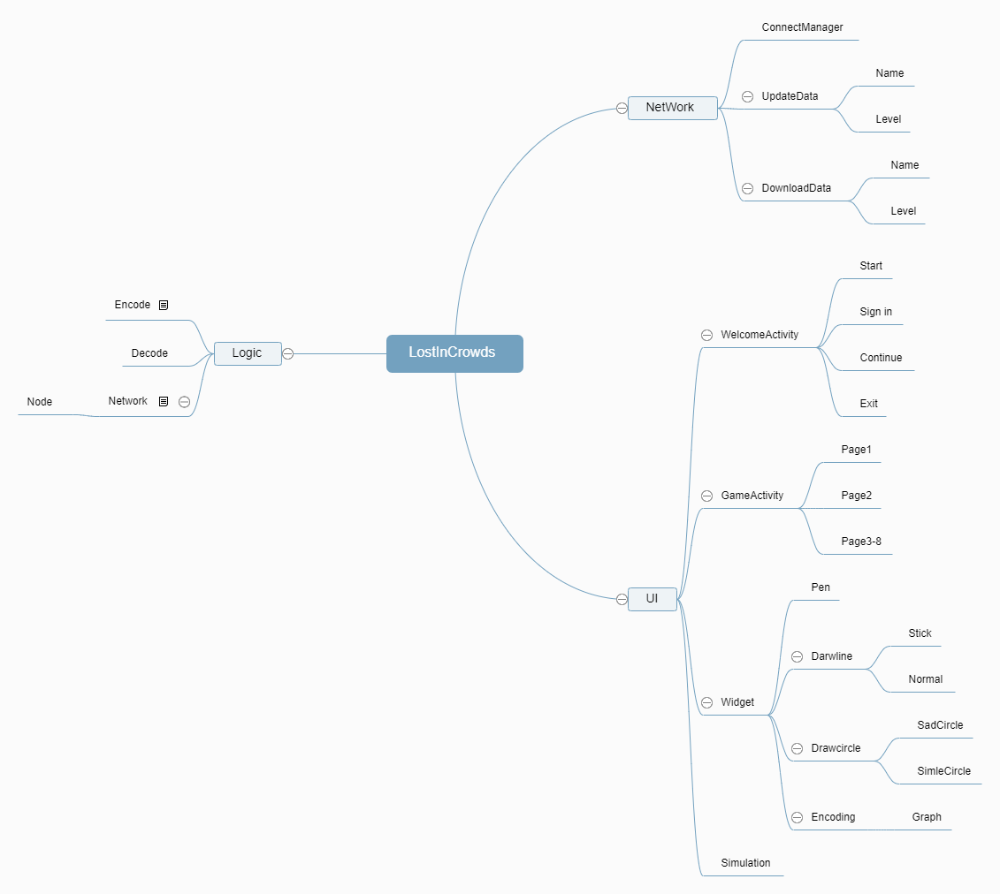

# LostInCrowds

## NetWork

### ConnectManager

### UpdateData

#### Name

#### Level

### DownloadData

#### Name

#### Level

## UI

### WelcomeActivity

#### Start

#### Sign in

#### Continue

#### Exit

### GameActivity

#### Page1

#### Page2

#### Page3-8

### Widget

#### Pen

#### Darwline

##### Stick

##### Normal

#### Drawcircle

##### SadCircle

##### SimleCircle

#### Encoding

##### Graph

### Simulation

## Logic

### Encode

Encoding：
root(Graph)

### Decode

### Network

Graph
Normal Graph
1.simple simulation
More than 50% spread（Bad thing）
More than 33% spread（Good thing）

2.CheckComplete

#### Node
